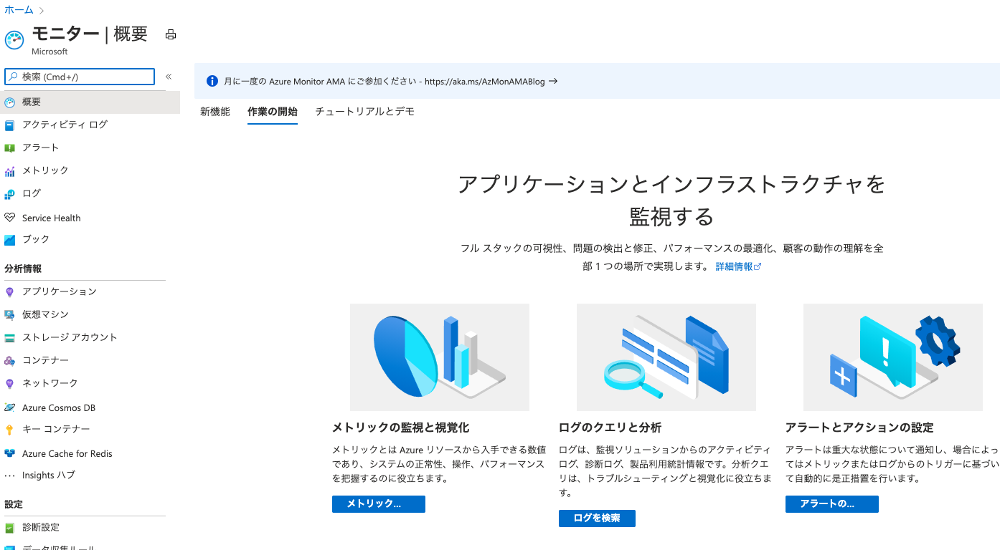
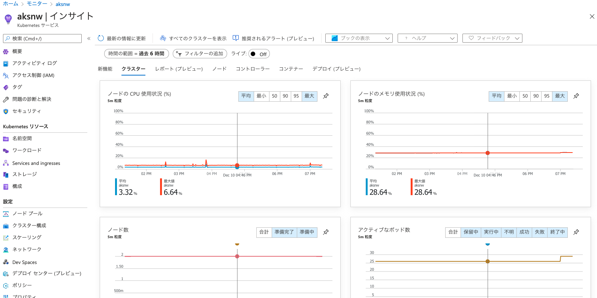
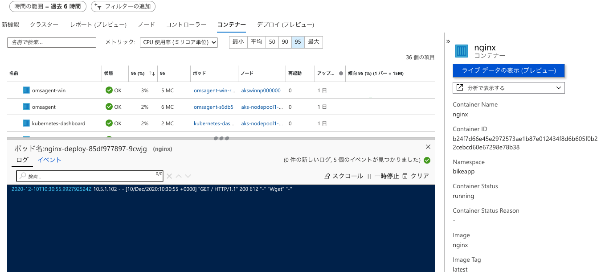
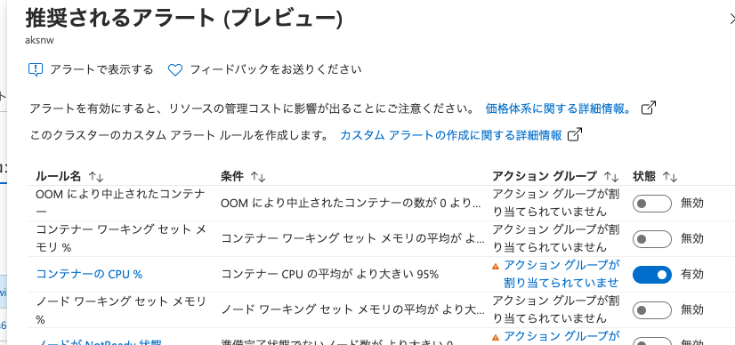

# Azure Kubernetes Service と Windows Container ワークショップ

Azure Kubernetes Service (AKS) は Azure でマネージドな Kubernetes クラスターを利用できるサービスです。 Window コンテナーをサポートしており、Windows コンテナー化された .NET アプリを pod としてデプロイして、自動回復やスケールアウトなど、柔軟な運用が可能です。このワークショップでは、 Windows ノードを含む AKS クラスターを作成し、 ASP .NET　アプリを pod としてデプロイし、サービスの公開やスケーリング、および Azure Monitor と連携したコンテナーの監視を実施します。

## 前提事項
本ワークショップは [ASP.NET と Windows Containers ワークショップ](windows-container-tools-workshop.md)の実施を前提としており、このワークショップで作成した Azure Container Registry(ACR) や ASP .NET コンテナーイメージを利用します。

## AKS クラスターの作成

AKS クラスターを作成し、Windows のノードプールを追加します

シェルを起動し、Azure CLI の `az aks create` を使用して AKS クラスターを作成します。 次の例では、 `<myResourceGroup>` という名前のリソース グループに `<myAKSCluster>` という名前のクラスターを作成します。 このリソース グループは、[前のワークショップ](windows-container-tools-workshop.md)で ACR 用に作成したリソースグループと同じものを利用します。次のコマンドではリージョンが指定されていませんので、 AKS クラスターは指定したリソースグループのリージョンで作成されます。また、 ACR からイメージをプルできるように、 AKS に ACR をアタッチするオプション `--attach-acr` が付与されています。前のワークショップで作成した ACR の名前を `<acrName>`に入力してください。

```azurecli
az aks create \
    --resource-group <myResourceGroup> \
    --name <myAKSCluster> \
    --node-count 1 \
    --generate-ssh-keys \
    --enable-addons monitoring \
    --windows-admin-password <your-strong-password> \
    --windows-admin-username azureuser \
    --network-plugin azure \
    --attach-acr <acrName>
```
作成した AKS クラスターで Azure Monitor を有効化するため、 `--enable-addons` オプションを追加していますが、 AKS クラスター作成後に有効化することも可能です。他にも多数のオプションを指定できます。 `az aks create` コマンドの詳細は[こちら](https://docs.microsoft.com/en-us/cli/azure/aks?view=azure-cli-latest#az_aks_create)を参照ください。

デプロイにはしばらく時間がかかります。デプロイが完了すると、この AKS クラスターに関する情報が JSON 形式で表示されます。

> 今回は実験用に1台のノードを指定していますが、運用環境で確実に動作するようにするには、少なくとも 3 つ以上のノードが望ましい構成です。

## Windows ノードプールの追加

AKS クラスターでは、同じ構成のノードを[ノードプール](https://docs.microsoft.com/ja-jp/azure/aks/use-multiple-node-pools)と呼ばる概念でグループ化して管理します。このため、構成の異なる複数種類のノード群で１つの AKS クラスターを構成することができます。AKS クラスターを作成すると、[システムノードプール](https://docs.microsoft.com/ja-jp/azure/aks/use-system-pools)と呼ばれる Linux のノードが作成されます。このノードプールには Kubernetes に必須のコンポーネントが稼働するため、削除できません。
`az aks nodepool list` コマンドで、ノードプールの構成を確認できます。

```
az aks nodepool list \
    --resource-group <myResourceGroup> \
    --cluster-name <myAKSCluster> \
    -o table
```

今回は Windows コンテナーを利用するため、 Windows のノードプールを追加します。ノードプールの追加には、 `az aks nodepool add` コマンドを利用します。下記のコマンドでは、 `npwin` という名前の Windows Server ノードプールを１台、 AKS クラスターに追加します。

```
az aks nodepool add \
    --resource-group <myResourceGroup> \
    --cluster-name <myAKSCluster> \
    --os-type Windows \
    --name npwin \
    --node-count 1
```

ノードの追加にはしばらく時間がかかります。 `az aks nodepool add` コマンドのオプションでVMのサイズなども指定できます。詳しくは[こちらのドキュメント](https://docs.microsoft.com/en-us/cli/azure/aks/nodepool?view=azure-cli-latest#az_aks_nodepool_add)を参照ください。

ノードの追加が完了したら、再び `az aks nodepool list` コマンドで状態を確認してみましょう。 `npwin` という名前のWindowsノードプールが追加されていることが確認できます。

## kubectl を使用したクラスターへの接続

ここからは、 Kubernetes の標準のコマンドラインツールである [kubectl](https://kubernetes.io/ja/docs/reference/kubectl/overview/) を用いて、 AKS クラスターを操作していきます。
 AKS クラスターに接続するように  `kubectl`  を構成するには、 `az aks get-credentials` コマンドを使用します。 

```azurecli
az aks get-credentials --resource-group <myResourceGroup> --name <myAKSCluster>
```
このコマンドの実行により、クライアント環境に AKS に接続するための接続設定ファイルが作成されます。

クラスターへの接続を確認するには、クラスター ノードの一覧を返す `kubectl get nodes` コマンドを実行します。

```
kubectl get nodes -o wide
```

コマンドを実行すると、 AKS クラスターのノードとして、 Linux のノードと Windows のノードがそれぞれ１台ずつ稼働しているのが確認できます。

## Windows コンテナーのデプロイ

kubectl を利用して[前のワークショップ](windows-container-tools-workshop.md)で作成した Windows コンテナーイメージを AKS クラスターにデプロイします。
Kubernetes でのコンテナーのデプロイなど、様々なオブジェクトを作成するために、マニフェスト (yaml 形式のファイル） を作成します。下記は Windows コンテナーをデプロイする Depolyment リソースのマニフェストになります。  `<acrName>` は Windows コンテナーイメージが保存されている ACR の名前に置き換えてください。

```
apiVersion: apps/v1
kind: Deployment
metadata:
  name: winaspnetapp
  labels:
    app: winaspnetapp
spec:
  replicas: 2
  template:
    metadata:
      name: winaspnetapp
      labels:
        app: winaspnetapp
    spec:
      nodeSelector:
        "kubernetes.io/os": windows
      containers:
      - name: winaspnetapp
        image: <acrName>.azurecr.io/aspnetwincontainerapp:latest
        resources:
          limits:
            cpu: 1
            memory: 800M
          requests:
            cpu: .1
            memory: 300M
        ports:
        - containerPort: 80
        livenessProbe:
          httpGet:
            path: /
            port: 80
          initialDelaySeconds: 10
          periodSeconds: 5
        readinessProbe:
          httpGet:
            path: /
            port: 80
          initialDelaySeconds: 10
          periodSeconds: 5
  selector:
    matchLabels:
      app: winaspnetapp
```
マニフェストの [yaml ファイル](../aks-deploy-win.yaml)

マニフェストのファイルを保存し、次のコマンドで Windows コンテナーを AKSクラスター にデプロイします。

`kubectl apply -f <yaml-file-name>`

AKS ではコンテナーは pod という単位で実行されます。このマニフェストにより、 Windows コンテナーイメージ `aspnetwincontainerapp:latest` を用いた pod が２つ、 AKS クラスターにデプロイされます。注意すべき点は、この pod は Windows ノードでのみ稼働できる点です。 AKS クラスターには Linux ノードも稼働しているため、この pod を Windows ノードにのみスケジュールする必要があります。このために、マニフェストには `nodeSelector` として `"kubernetes.io/os": windows` のラベルが指定されています。これにより、 Windows コンテナーはこのラベルを持つ Windows ノードにのみスケジュールされ、実行されます。

下記のコマンドで AKS のノードに設定されたラベルが確認できます。

```
kubectl get node --show-labels
```

先ほど Windows コンテナーをデプロイしたときに利用したマニフェストでは、 pod のレプリカを 2 つ作成しました。 AKS クラスターに存在する pod の数と状態を確認するため、 `kubectl get` コマンドを使用します

```
kubectl get pods -o wide
````

出力の結果、 Wndows コンテナーの pod が 2 つ存在することがわかります。また、稼働するノードについても、名前に `npwin` を含む Windows ノードで稼働していることが確認できます。
適切なノードにうまく pod がスケジュールされるようにする方法としては、他にも `taint` を利用する方法があります。主に Windows ノードのみを利用するような場合、Linuxノードに `taint` を設定することで、 `toleration` が設定されていない pod は自動的に Windows ノードでのみ実行するようにできます。詳細は[こちら](https://kubernetes.io/ja/docs/concepts/scheduling-eviction/taint-and-toleration/)を参照ください。

## Windows コンテナーアプリの AKS クラスター外部への公開

AKS に Windows コンテナーのデプロイがきましたので、次にアプリを外部のクライアント環境からアクセスできるようにします。このために Kubernetes の Service リソースを次のマニフェストを用いて作成します。

```
apiVersion: v1
kind: Service
metadata:
  name: winaspnetapp
spec:
  type: LoadBalancer
  ports:
  - protocol: TCP
    port: 80
  selector:
    app: winaspnetapp
```
マニフェストの [yamlファイル](../aks-svc.yaml)

マニフェストのファイルを保存し、次のコマンドで Service リソースを作成します。

`kubectl apply -f <yaml-file-name>`

次のコマンドで、作成された Service リソースを確認します。

```
kubectl get service -w
```

上記コマンドの`-w`オプションで継続的に状態を確認できます。しばらくすると `EXTERNAL-IP` に値がパブリック IP アドレスが表示されるので、ブラウザを開いて表示された IP アドレスに接続してください。


無事に Windows コンテナーのアプリに接続できていることが確認できます。
Service リソースを AKS に作成することにより、 Azure の AKS 用のロードバランサーが自動的に構成され、外部から接続可能となります。

## Windows コンテナー pod のスケーリング

先ほど Windows コンテナーをデプロイしたときに pod のレプリカを 2 つ作成しました。 もう一度 pod の数と状態を確認してみます

```
kubectl get pods
````

pod の数を手動で変更するには、 `kubectl scale` コマンドを利用します。 次の例では、 pod の数を 3 に増やしています。

```
kubectl scale --replicas=3 deployment/winaspnetapp
```
AKS に追加の pod が作成されていることを確認するために、もう一度 `kubectl get pods` を実行します。 

```
kubectl get pods
```

しばらくすると、追加した pod が AKS クラスターで利用できる状態になります。

このように、アプリに対する負荷が高まった場合には、簡単に pod をスケールして対応することができます。pod の負荷状態を確認するには、 `kubectl top` コマンドを利用します。

```
kubectl top pods
```

各 pod の cpu やメモリーの利用状況が表示されます。

> AKS は pod の[水平自動スケーリング(HPA)](https://kubernetes.io/docs/tasks/run-application/horizontal-pod-autoscale/)をサポートしており、 CPU 利用率などの選ばれたメトリックに応じて、デプロイする pod 数を自動調整できます。 


## AKS ノードの手動スケーリング

AKS クラスターには現在 Windows ノードが 1 つあります。 AKS クラスターの pod を増減する場合は、ノードの数を手動で調整できます。
次の例では、 AKS クラスターの Windows ノードの数を 2 に増やしています。 コマンドが完了するまでに数分かかります。

```
az aks nodepool scale \
    --resource-group <myResourceGroup> \
    --cluster-name <myAKSCluster> \
    --name npwin \
    --node-count 2 \
    --no-wait
```

下記のコマンドでノード数を確認します。 npwin ノードプールのカウントが2になっていることが確認できます。

```
az aks nodepool list \
    --resource-group <myResourceGroup> \
    --cluster-name <myAKSCluster> \
    -o table
```

このように、 AKS で稼働するアプリの負荷に合わせて、ノード数も容易に増減させることができます。

> AKS はノードの[オートスケール](https://docs.microsoft.com/ja-jp/azure/aks/cluster-autoscaler)にも対応しています。

## pod のコンテナーイメージのバージョンアップ

アプリのソースコードを更新して新しいバージョンのコンテナーイメージをビルドした場合、新しいコンテナイメージを用いて AKS で稼働する既存のアプリをローリングアップデートできます。マニフェストで指定した `image` を変更することでアップデート可能ですが、ここでは `kubectl set image` コマンを用いてアップデートを実施します。

```
kubectl set image deployment/winaspnetapp winaspnetapp=<acrName>.azurecr.io/aspnetwincontainerapp:v2
```

しかし実際に上記に指定したコンテナイメージは ACR に保存されていませんので、エラーとなります。下記のコマンドで状況を確認してみます。

```
kubectl get pods
```

ローリングアップデートのデフォルト設定では `maxUnavailable` が25%であるため、3つの pod のうち1つだけ更新を試みて、エラーになっていることがわかります。実際にエラーの内容を確認するには、下記のコマンドを実行します。 `<podName>` に確認したい pod の名前を入力します。

```
kubectl describe pod/<podName>
```

コンテナイメージが見つからないためにエラーとなっていることが確認できます。

では、このアップデートを取りやめてみましょう。ロールバックするには、下記のコマンドを実行します。

```
kubectl rollout undo deployment/winaspnetapp
```

もう一度状態を確認すると、無事に pod が全て稼働しているのが確認できます。

```
kubectl get pods
```

## pod の自動回復

AKS では、異常終了や強制停止させられてしまった pod は、 Deployment のマニフェストに記載された状態に回復するように制御されます。次のコマンドを実行し、pod を１つ強制的に停止してみます。

```
kubectl delete pod/<podName>
```

もう一度、稼働している pod を確認してみましょう。

```
kubectl get pods
```
停止した pod は削除されていますが、新たな pod がデプロイされていることが確認できます。
また、今回利用したDeployment のマニフェストには、 `livenessProbe` を定義しています。これにより、定期的に pod の状態を確認し、問題があれば自動的に pod を停止して再起動することで、自動回復することもできます。

## Azure Monitor for Containerによる監視

[Azure ポータル](portal.azure.com)を開き、画面上部の検索ボックスで`モニター`と入力すると、 Azure Monitor のアイコンが下に表示されます。これをクリックして、 Azure Monitor のトップ画面に移動します。





左側に並ぶメニューのうち、`コンテナー`をクリックします。右側ペインの`監視対象クラスター`をクリックすると、 Azure Monitor が有効となっている Kubernetes クラスター一覧が表示されますので、今回作成した AKS クラスターをクリックします。





画面上に、 AKS クラスターの CPU やメモリの利用状況などが表示されます。`ノード` `コンテナー`などをクリックすると、それぞれの詳細が表示されます。`コンテナー`画面では、個別のコンテナのライブログを`ライブデータの表示（プレビュー）`からも確認できます。





AKS のログやメトリックをもとに特定の条件でアラート通知を実施することも可能です。同じ画面の上部に`奨励されるアラート（プレビュー）`をクリックすると、AKSの監視に適したアラートルール一覧が表示され、すぐに有効にすることができます。





以上でワークショップは終了です。お疲れ様でした。

