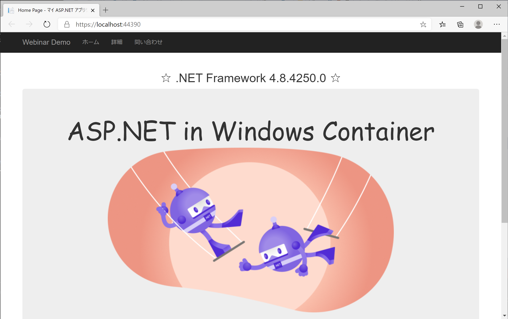

# Azure Kubernetes Service と Windows Container ワークショップ

Azure Kubernetes Service (AKS) は Azure でマネージドな Kubernetes クラスターを利用できるサービスです。 Window コンテナーをサポートしており、コンテナー化された .NET アプリを pod としてデプロイして、自動回復やスケールアウトなど、柔軟な運用が可能です。このワークショップでは、 Windows ノードを含む AKS クラスターを作成し、 ASP .NET　アプリをpodしてデプロイし、サービスの公開やスケーリング、およびAzure Monitorと連携したコンテナーの監視を実施します。

## 前提事項
本ワークショップは[ASP.NET と Windows Containers ワークショップ](container-tools.md)の実施を前提としており、このワークショップで作成したAzure Container Registry(ACR)やASP .NETコンテナーイメージを利用します。

## AKS クラスターの作成

AKS クラスターを作成し、Windows のノードプールを追加します

シェルを起動し、Azure CLIの`az aks create`を使用して AKS クラスターを作成します。 次の例では、`<myResourceGroup>` という名前のリソース グループに `<myAKSCluster>` という名前のクラスターを作成します。 このリソース グループは、[前のワークショップ](container-tools.md)でACR用に作成したリソースグループと同じものを利用します。次のコマンドではリージョンが指定されていませんので、AKS クラスターは指定したリソースグループのリージョンで作成されます。また、ACRからイメージをプルできるように、 AKSにACRをアタッチするオプション`--attach-acr`が付与されています。前のワークショップで作成したACRの名前を `<acrName>`に入力してください。

```azurecli
az aks create \
    --resource-group <myResourceGroup> \
    --name <myAKSCluster> \
    --node-count 1 \
    --generate-ssh-keys \
    --enable-addons monitoring \
    --windows-admin-password <your-strong-password> \
    --windows-admin-username azureuser \
    --network-plugin azure \
    --attach-acr <acrName>
```
作成したAKSクラスターでAzure Monitorを有効化するため、`--enable-addons`オプションを追加していますが、AKSクラスター作成後に有効化することも可能です。他にも多数のオプションを指定できます。`az aks create`コマンドの詳細は[こちら](https://docs.microsoft.com/en-us/cli/azure/aks?view=azure-cli-latest#az_aks_create)を参照ください。

デプロイにはしばらく時間がかかります。デプロイが完了すると、この AKS デプロイに関する情報が JSON 形式で表示されます。

> 今回は実験用に1台のノードを指定していますが、確実に動作するようにするには、少なくとも 3 つのノードの実行が望ましい構成です。

## Windowsノードプールの追加

AKSクラスターでは、同じ構成のノードを[ノードプール](https://docs.microsoft.com/ja-jp/azure/aks/use-multiple-node-pools)と呼ばる概念でグループ化して管理します。このため、構成の異なる複数種類のノード群で１つのAKSクラスターを構成することができます。AKSクラスターを作成すると、[システムノードプール](https://docs.microsoft.com/ja-jp/azure/aks/use-system-pools)と呼ばれるLinuxのノードが作成されます。このノードプールにはKubernetesに必須のコンポーネントが稼働するため、削除できません。
`az aks nodepool list`コマンドで、ノードプールの構成を確認できます。

```
az aks nodepool list \
    --resource-group <myResourceGroup> \
    --cluster-name <myAKSCluster> \
    -o table
```

今回はWindowsコンテナーを利用するため、Windowsのノードプールを追加します。ノードプールの追加には、`az aks nodepool add`コマンドを利用します。下記のコマンドでは、`npwin`という名前のWindows Serverノードプールを１台、AKSクラスターに追加します。

```
az aks nodepool add \
    --resource-group <myResourceGroup> \
    --cluster-name <myAKSCluster> \
    --os-type Windows \
    --name npwin \
    --node-count 1
```

ノードの追加にはしばらく時間がかかります。`az aks nodepool add`コマンドのオプションでVMのサイズなども指定できます。詳しくは[こちらのドキュメント](https://docs.microsoft.com/en-us/cli/azure/aks/nodepool?view=azure-cli-latest#az_aks_nodepool_add)を参照ください。

ノードの追加が完了したら、再び`az aks nodepool list`コマンドで状態を確認してみましょう。`npwin`という名前のWindowsノードプールが追加されていることが確認できます。

## kubectl を使用したクラスターへの接続

ここからは、Kubernetesの標準のコマンドラインツールである[kubectl](https://kubernetes.io/ja/docs/reference/kubectl/overview/)を用いて、Kubernetesを操作していきます。
Kubernetes クラスターに接続するように `kubectl` を構成するには、`az aks get-credentials`コマンドを使用します。 

```azurecli
az aks get-credentials --resource-group <myResourceGroup> --name <myAKSCluster>
```
このコマンドの実行により、クライアント環境にKubernetesに接続するための接続設定ファイルが作成されます。

クラスターへの接続を確認するには、クラスター ノードの一覧を返す `kubectl get nodes` コマンドを実行します。

```
kubectl get nodes -o wide
```

コマンドを実行すると、AKSクラスターのノードとして、LinuxのノードとWindowsのノードがそれぞれ１台ずつ稼働しているのが確認できます。

## Windowsコンテナーのデプロイ

kubectlを利用して[前のワークショップ](container-tools.md)で作成したWindowsコンテナーイメージをAKSクラスターにデプロイします。
Kubernetesでのコンテナーのデプロイなど、様々なオブジェクトを作成するために、マニフェスト(yamlファイル）を作成します。下記はWindowsコンテナーをデプロイするDepolymentオブジェクトのマニフェストになります。 `<acrName>`はWindowsコンテナーイメージが保存されているACRの名前に置き換えてください。


```
cat <<EOF | kubectl apply -f -
apiVersion: apps/v1
kind: Deployment
metadata:
  name: winaspnetapp
  labels:
    app: winaspnetapp
spec:
  replicas: 2
  template:
    metadata:
      name: winaspnetapp
      labels:
        app: winaspnetapp
    spec:
      nodeSelector:
        "kubernetes.io/os": windows
      containers:
      - name: winaspnetapp
        image: <acrName>.azurecr.io/aspnetwincontainerapp:latest
        resources:
          limits:
            cpu: 1
            memory: 800M
          requests:
            cpu: .1
            memory: 300M
        ports:
        - containerPort: 80
        livenessProbe:
          httpGet:
            path: /
            port: 80
          initialDelaySeconds: 10
          periodSeconds: 5
        ReadinessProbe:
          httpGet:
            path: /
            port: 80
          initialDelaySeconds: 10
          periodSeconds: 5
  selector:
    matchLabels:
      app: winaspnetapp
EOF
```
[yamlファイル](../aks-deploy-win.yaml) - `kubectl apply -f <yaml-file-name>`

AKSではコンテナーはpodという単位で実行されます。このマニフェストにより、Windowsコンテナーイメージ`aspnetwincontainerapp:latest`を用いたpodが２つ、AKSクラスターにデプロイされます。注意すべき点は、このpodはWindowsノードでのみ稼働できる点です。AKSクラスターにはLinuxノードも稼働しているため、このpodをWindowsノードでのみスケジュールする必要があります。このために、マニフェストに`nodeSelector`として`"kubernetes.io/os": windows`のラベルが指定されています。これにより、Windowsコンテナーはこのラベルを持つwindowsノードにの実行されます。

下記のコマンドでAKSのノードに設定されたラベルが確認できます。

```
kubectl get node --show-labels
```

先ほどWindowsコンテナーをデプロイしたときに利用したマニフェストでは、podのレプリカを 2 つ作成しました。 AKSクラスターに存在するpodの数と状態を確認するため、`kubectl get`コマンドを使用します

```
kubectl get pods -o wide
````

出力の結果、Wndowsコンテナーのpodが 2 つ存在することがわかります。また、稼働するノードについても、名前に`npwin`を含むWindowsノードで稼働していることが確認できます。
適切なノードにうまくpodがスケジュールされるようにする方法としては、他にも`taint`を利用する方法があります。主にWindowsノードのみを利用する場合、Linuxノードに`taint`を設定することで、`toleration`が設定されていないpodはWindowsノードでのみ実行するようにできます。詳細は[こちら](https://kubernetes.io/ja/docs/concepts/scheduling-eviction/taint-and-toleration/)を参照ください。

## WindowsコンテナーアプリのAKSクラスター外部への公開

AKSにWindowsコンテナーのデプロイがきましたので、次にアプリを外部のクライアント環境からアクセスできるようにします。このためにKubernetesのserviceオブジェクトを次のマニフェストを用いて作成します。

```
cat <<EOF | kubectl apply -f -
apiVersion: v1
kind: Service
metadata:
  name: winaspnetapp
spec:
  type: LoadBalancer
  ports:
  - protocol: TCP
    port: 80
  selector:
    app: winaspnetapp
EOF
```
[yamlファイル](../aks-svc.yaml) - `kubectl apply -f <yaml-file-name>`

次のコマンドで、作成されたserviceオブジェクトを確認します。

```
kubectl get service -w
```

上記コマンドの`-w`オプションで継続的に状態を確認できます。しばらくすると`EXTERNAL-IP`に値がパブリックIPアドレス表示されるので、ブラウザを開いて表示されたIPアドレスに接続してください。



無事にWindowsコンテナーのアプリに接続できていることが確認できます。
実際には、serviceのオブジェクトをAKSに作成することにより、AzureにおいてAKS用のロードバランサーが自動的に構成され、外部から接続可能となります。

## Windowsコンテナーpodのスケーリング

先ほどWindowsコンテナーをデプロイしたときにpodのレプリカを 2 つ作成しました。 もう一度podの数と状態を確認してみます

```
kubectl get pods
````

podの数を手動で変更するには、`kubectl scale`コマンドを使います。 次の例では、podの数を 3 に増やしています。

```
kubectl scale --replicas=3 deployment/winaspnetapp
```
AKS によって追加のポッドが作成されていることを確認するために、もう一度 `kubectl get pods` を実行します。 

```
kubectl get pods
```

しばらくすると、追加したpodがAKSクラスターで利用できる状態になります。

このように、アプリに対する負荷が高まった場合には、簡単にpodをスケールして対応することができます。podの負荷状態を確認するには、`kubectl top`コマンドを利用します。

```
kubectl top pods
```

各podのcpuやメモリーの利用状況が表示されます。

> AKSはpodの[水平自動スケーリング(HPA)](https://kubernetes.io/docs/tasks/run-application/horizontal-pod-autoscale/)をサポートしており、CPU 使用率などの選ばれたメトリックに応じて、デプロイのpod数を調整できます。 


## AKS ノードの手動スケーリング

AKS クラスターには現在Windowsノードが 1 つあります。 AKS クラスターのpodを増減する場合は、ノードの数を手動で調整できます。
次の例では、AKS クラスターのノードの数を 3 に増やしています。 コマンドが完了するまでに数分かかります。

```
az aks nodepool scale \
    --resource-group <myResourceGroup> \
    --cluster-name <myAKSCluster> \
    --name npwin \
    --node-count 2 \
    --no-wait
```

下記のコマンドでノード数を確認します。npwinノードプールのカウントが2になっていることが確認できます。

```
az aks nodepool list \
    --resource-group <myResourceGroup> \
    --cluster-name <myAKSCluster> \
    -o table
```

このように、AKSで稼働するアプリの負荷に合わせて、ノード数も容易に増減させることができます。

## podのコンテナーイメージのバージョンアップ

アプリのソースコードを更新して新たしいバージョンのコンテナーイメージをビルドした場合、新しいコンテナイメージを用いてAKSで稼働する既存のアプリをローリングアップデートできます。マニフェストで指定した`image`を変更することでアップデート可能ですが、ここでは`kubectl set image`コマンを用いてアップデートを実施します。

```
kubectl set image deployment/winaspnetapp winaspnetapp=<acrName>.azurecr.io/aspnetwincontainerapp:v2
```

しかし実際に上記に指定したコンテナイメージはACRに保存されていませんので、エラーとなります。下記のコマンドで状況を確認してみます。

```
kubectl get pods
```

ローリングアップデートのデフォルトでは`maxUnavailable`が25%であるため、podの1つだけ更新を試みてエラーになっていることがわかります。実際にエラーの内容を確認するには、下記のコマンドを実行します。`<podName>`に確認したいpodの名前を入力します。

```
kubectl describe pod/<podName>
```

コンテナイメージが見つからないためにエラーとなっていることが確認できます。

では、このアップデートを取りやめてみましょう。ロールバックするには、下記のコマンドを実行します。

```
kubectl rollout undo deployment/winaspnetapp
```

もう一度状態を確認すると、無事にpodが全て稼働しているのが確認できます。

```
kubectl get pods
```

## podの自動回復

AKSでは、異常終了や強制停止させられてしまったpodは、マニフェストに記載された状態に回復するように制御されます。次のコマンドを実行し、podを１つ強制的に停止してみます。

```
kubectl delete pod/<podName>
```

もう一度、稼働しているpodを確認してみましょう。

```
kubectl get pods
```
停止したpodは削除されていますが、新たなpodがデプロイされていることが確認できます。今回利用したマニフェストには、`livenessProbe`を定義しています。これにより、定期的にpodの状態を確認し、問題があれば自動的に停止して再起動することで、自動回復することができます。

## Azure Monitor for Containerによる監視

portal.azure.comを開き、画面上部の検索ボックスでモニターと入力すると、Azure Monitorのアイコンが下に表示されます。これをクリックして、Azure Monitorのトップ画面に移動します。


左側に並ぶメニューのうち、`コンテナー`とクリックします。右側ペインの`監視対象クラスター`をクリックすると、Azure Monitorが有効となっているKubernetesクラスター一覧が表示されますので、今回作成したAKSクラスターをクリックします。


画面上に、AKSクラスターのCPUやメモリの利用状況などが表示されます。`ノード` `コンテナー`などをクリックすると、それぞれの詳細が表示されます。`コンテナー`画面では、個別のコンテナのライブログを`ライブデータの表示（プレビュー）`からも確認できます。


AKSのログやメトリックをもとに特定の条件でアラート通知を実施することも可能です。同じ画面の上部に`奨励されるアラート（プレビュー）`をクリックすると、AKSの監視に適したアラートルール一覧が表示され、すぐに有効にすることができます。


以上でワークショップは終了です。お疲れ様でした。

