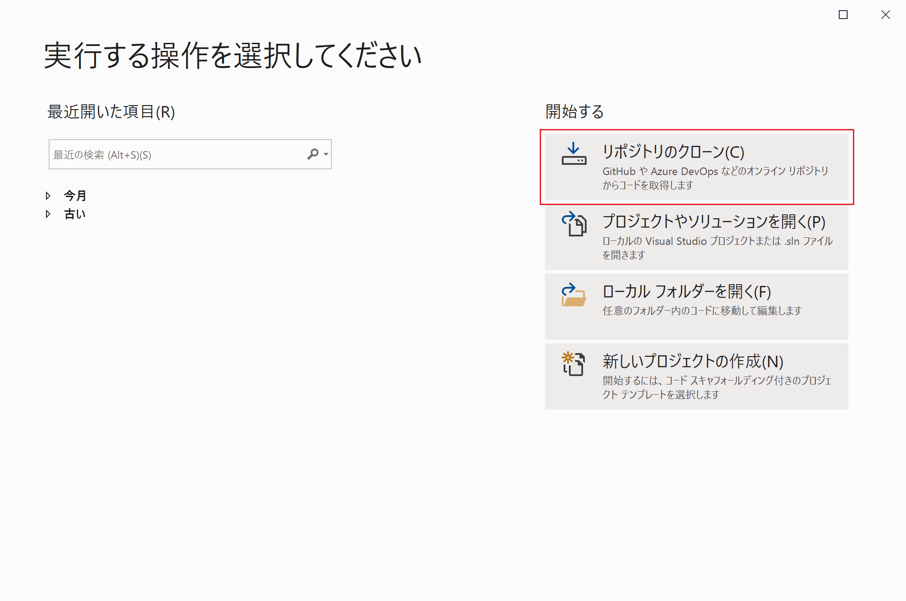
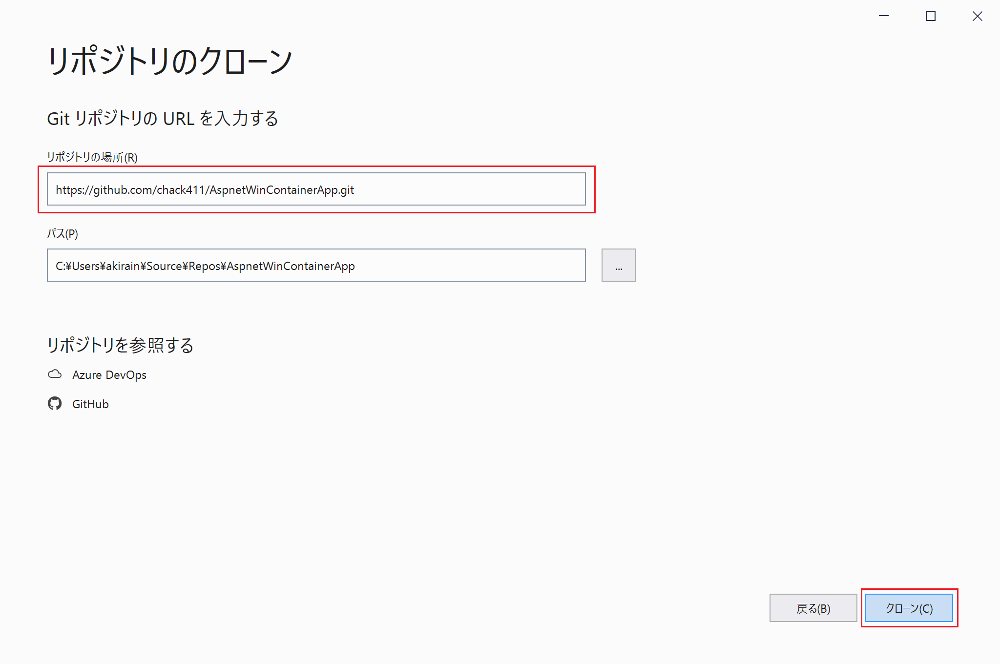

# ASP.NET と Windows Containers ワークショップ

Visual Studio を使用すると、コンテナー化された .NET、ASP.NET、および ASP.NET Core アプリを簡単にビルド、デバッグ、および実行して、Azure Container Registry (ACR)、Docker Hub、Azure App Service、または独自のコンテナー レジストリに発行することができます。 このワークショップでは、ASP.NET アプリを Visual Studio 2019 を使って Windows Container イメージにビルドしたのち、ACR に発行します。

## 必須コンポーネント

* [Azure サブスクリプション無料試用版](https://azure.microsoft.com/ja-jp/free/dotnet/)
* [Azure CLI](https://docs.microsoft.com/ja-jp/cli/azure/install-azure-cli)
* [Docker Desktop](https://hub.docker.com/editions/community/docker-ce-desktop-windows)
* [kubectl CLI](https://kubernetes.io/ja/docs/tasks/tools/install-kubectl/#install-kubectl-on-windows) (Docker Desktop でも一緒にインストールされます)
* `ASP.NET と Web 開発`、`Azure の開発` ワークロードと、`.NET Framework 4.8 SDK`、`.NET Framework 4.8 Targeting Pack`、`Git for Windows`、`GitHub Extension for Visual Studio` 個別コンポーネントを選択してインストールした [Visual Studio 2019](https://visualstudio.microsoft.com/downloads)

## サンプル ASP.NET Web アプリケーションの準備

Visual Studio 2019 を起動し、最初に表示される `スタートウィンドウ` にある `リポジトリのクローン(C)` をクリックします。



続いて `リポジトリの場所(R)` に以下の URL を入力します。

```console
https://github.com/chack411/AspnetWinContainerApp.git
```

`パス(P)` の場所が問題ないか確認したのちに、`クローン(C)` ボタンをクリックします。



> または、コマンド プロンプトを開いて、サンプルソースコードをダウンロードしたいフォルダに移動したのち、次の git コマンドを実行したのち、クローンしたフォルダ内にある `AspnetWinContainerApp.sln` ファイルを Visual Studio 2019 で開きます。

```console
git clone https://github.com/chack411/AspnetWinContainerApp.git
```

## Dockerfile をプロジェクトを追加する

1. ソリューション エクスプローラーのプロジェクト名 `WebinarWebASpp10dc` 上で右クリックして、`[追加]-[Docker サポート]` をクリックします。

1. コンテナーの種類 `Windows` を選択し、 `[作成]` をクリックします。

1. プロジェクトの種類に従い、`Dockerfile` が自動生成されプロジェクトに追加されます。

## Dockerfile の概要

自動生成された `Dockerfile` は以下の通りです。その中に含まれるコマンドの詳細については、「[Dockerfile reference](https://docs.docker.com/engine/reference/builder/)」 (Dockerfile リファレンス) を参照してください。

```dockerfile
#Depending on the operating system of the host machines(s) that will build or run the containers, the image specified in the FROM statement may need to be changed.
#For more information, please see https://aka.ms/containercompat 

FROM mcr.microsoft.com/dotnet/framework/aspnet:4.8-windowsservercore-ltsc2019
ARG source
WORKDIR /inetpub/wwwroot
COPY ${source:-obj/Docker/publish} .
```

サンプルアプリケーションは、.NET Framework/ASP.NET を使用しているため、この `Dockerfile` は、[microsoft/aspnet](https://hub.docker.com/_/microsoft-dotnet-framework-aspnet) の基本イメージを使用しています。

## デバッグ

ツールバーのデバッグ ドロップダウンから `[Docker]` を選択し、アプリのデバッグを開始します。 証明書の信頼を求めるメッセージが表示される場合があります。続行するには、証明書を信頼することを選びます。

`[出力]` ウィンドウの `[コンテナー ツール]` オプションに、実行されているアクションの内容が表示されます。 初めての場合、基本イメージのダウンロードにしばらく時間がかかる場合がありますが、以降の実行でははるかに高速になります。

## コンテナー ウィンドウ

Visual Studio 2019 バージョン 16.4 以降をお持ちの場合は、 `[コンテナー]` ウィンドウを使用して、ご利用のコンピューター上で実行中のコンテナー、および使用可能なイメージを確認できます。

IDE の [検索] ボックスを使用して (`Ctrl+Q` を押して使用)、 `[コンテナー]` ウィンドウを開き、`コンテナー` を入力し、一覧から `[コンテナー]` ウィンドウを選択します。

`[コンテナー]` ウィンドウをエディターの下などの便利な場所に配置するには、ウィンドウを移動してウィンドウ配置ガイドに従います。

ウィンドウで、ご利用のコンテナーを見つけ、各タブをステップ実行して、環境変数、ポート マッピング、ログ、およびファイル システムを表示します。


## Docker イメージの発行

アプリの開発とデバッグのサイクルが完了後、リリース用の Docker イメージを作成して、`Azure Container Registry` に発行します。

1. `ソリューション構成` ドロップダウンを `[Release]` に変更し、アプリを構築します。
1. `ソリューション エクスプローラー` で対象のプロジェクトを右クリックし、 `[発行]` を選択します。
1. `[発行]` ダイアログで `[Docker コンテナー レジストリ]` タブを選択します。

   ![発行ダイアログのスクリーンショット - [Docker コンテナー レジストリ] を選択する](../../media/container-tools/vs-2019/docker-container-registry.png)

1. `[新しい Azure Container Registry を作成する]` を選択します。

   ![発行ダイアログのスクリーンショット - [新しい Azure Container Registry を作成する] を選択する](../../media/container-tools/vs-2019/select-existing-or-create-new-azure-container-registry.png)

1. `[新しい Azure コンテナー レジストリを作成する]` で、目的の値を入力します。

    | 設定      | 推奨値  | 説明                                |
    | ------------ |  ------- | -------------------------------------------------- |
    | **DNS プレフィックス** | グローバルに一意の名前 | コンテナー レジストリを一意に識別する名前。 |
    | **サブスクリプション** | サブスクリプションの選択 | 使用する Azure サブスクリプション。 |
    | **[リソース グループ](/azure/azure-resource-manager/resource-group-overview)** | myResourceGroup |  コンテナー レジストリを作成するリソース グループの名前。 新しいリソース グループを作成する場合は、 **[新規]** を選択します。|
    | **[SKU](/azure/container-registry/container-registry-skus)** | 標準 | コンテナー レジストリのサービス層  |
    | **レジストリの場所** | 近くの場所 | [[地域]](https://azure.microsoft.com/regions/) で、自分に近いか、またはコンテナー レジストリを使用する他のサービスに近い場所を選択します。 |

    ![Visual Studio の Azure コンテナー レジストリを作成するダイアログ][0]

1. `[作成]` をクリックします。 これで `[発行]` ダイアログに作成したレジストリが表示されます。

   

1. `[完了]` を選択し、Azure で新しく作成したレジストリにコンテナー イメージを発行するプロセスを完了します。

   

これでレジストリからコンテナーを、[Azure App Service](https://docs.microsoft.com/ja-jp/azure/app-service/quickstart-custom-container?pivots=container-windows) や、[Azure Kubernetes Service (AKS)](https://docs.microsoft.com/ja-jp/azure/aks/windows-container-cli) などの Windows Container イメージを実行できるサービスにデプロイできるようになりました。

## Docker CLI の操作

Dockerfile の作成から Docker イメージのビルドや実行まで、Visual Studio 2019 の IDE から操作が可能ですが、基本的な Docker CLI の操作にも慣れておきましょう。

コマンドプロンプトを開き次のコマンドを実行すると、ローカル環境にある Docker イメージの一覧を確認できます。

```console
docker images
```
下記は `docker images` の実行結果の出力例です。レジストリ名 (コンテナー イメージ名) や、タグ名、サイズなどを確認することができます。

```console
C:\>docker images
REPOSITORY                                    TAG                              IMAGE ID            CREATED             SIZE
akirainaks.azurecr.io:443/AspnetWinContainerApp   20201203003554                   5c9baf1c1445        5 days ago          8.41GB
AspnetWinContainerApp                             latest                           5c9baf1c1445        5 days ago          8.41GB
AspnetWinContainerApp                             dev                              2549f8a4d385        7 days ago          8.38GB
mcr.microsoft.com/dotnet/aspnet               5.0                              7e2f94b6b184        3 weeks ago         353MB
mcr.microsoft.com/dotnet/framework/aspnet     4.8-windowsservercore-ltsc2019   4d714b4a56de        3 months ago        8.37GB
```

続いて、下記の `docker run` コマンドでは、指定した Docker コンテナー イメージを名前 `wincon1` で実行します。併せて、Windows 用の Web サーバーである IIS (Internet Information Services) サービス `w3svc` を起動します。

```console
docker run -it --entrypoint cmd --name wincon1 AspnetWinContainerApp:latest /c "start /B C:\ServiceMonitor.exe w3svc"
```

続いて、下記の `docker ps` コマンドでは、Docker コンテナーを列挙します。

```console
docker ps
```

下記は `docker ps` の実行結果の出力例です。`docker run` コマンドで実行した Docker コンテナーの ID や名前、ステータスなどを確認することができます。

```console
C:\>docker ps
CONTAINER ID        IMAGE                      COMMAND                  CREATED              STATUS              PORTS               NAMES
107c9307b3ba        AspnetWinContainerApp:latest   "cmd /c 'start /B C:…"   About a minute ago   Up 56 seconds       80/tcp              wincon1
```

続く、下記の `docker exec` コマンドでは、実行中の Docker コンテナーでコマンド `powershell` を実行します。

```console
docker exec -it wincon1 powershell
```

下記は `docker exec` の実行結果例です。実行中の Docker コンテナー内で PowerShell が実行され、各種コマンド (`ls` など) を実行することができます。また、`exec` で PowerShell を終了します。

```console
Windows PowerShell
Copyright (C) Microsoft Corporation. All rights reserved.

PS C:\inetpub\wwwroot> ls


    Directory: C:\inetpub\wwwroot


Mode                LastWriteTime         Length Name
----                -------------         ------ ----
d-----        12/3/2020   9:35 AM                bin
d-----        12/3/2020   9:35 AM                Content
d-----        12/3/2020   9:35 AM                fonts
d-----        12/3/2020   9:35 AM                Scripts
d-----        12/3/2020   9:35 AM                Views
-a----        12/1/2020   3:32 PM           9079 ApplicationInsights.config
-a----        9/30/2020   9:00 PM          32038 favicon.ico
-a----        9/30/2020   9:00 PM            109 Global.asax
-a----        12/3/2020   9:35 AM           5548 Web.config

PS C:\inetpub\wwwroot> exit

C:\>
```

下記の、`docker stop` コマンドは、実行中の Docker コンテナーの停止し、続く `docker rm` コマンドでは Docker コンテナーを削除します。

```console
docker stop wincon1
docker rm wincon1
```

続いて、Azure Kubernetes Service (AKS) クラスターを作成し、Windows Container をデプロイします。
